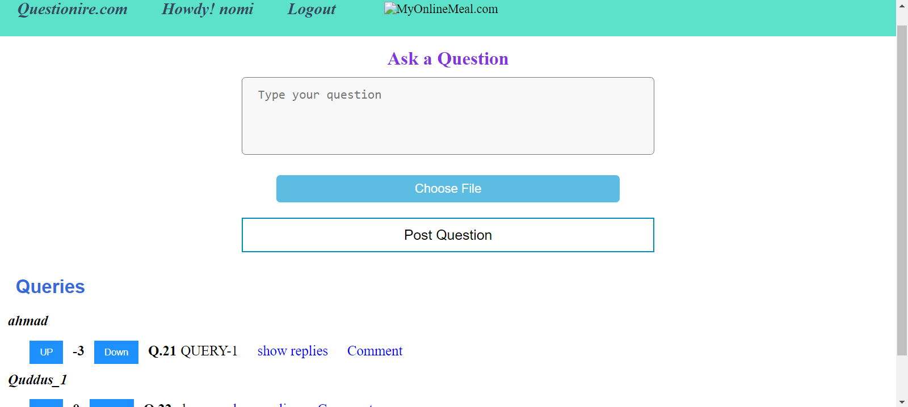

# Collaborative Home Work
It is a web app made using stacks django , javascript, html and css. The app allows students (users) to signup and then login to their account. Once Logged in they
can ask questions (queries) in form of text and images. They can also view other questions posted by other users , answers to those questions and up/down vote of each thread.
Students can also answer other users queries. So basically it is a collaborative platform like stackover flow for students to ease them doing their homework.

## Installation

Use the package manager [pip](https://pip.pypa.io/en/stable/) to install following packages.
Django :- 
```bash
pip install django
```
django_extensions
```bash
pip install django_extensions
```
Pillow
```bash
pip install Pillow
```

## Usage
Open CMD in the main directory ie "Collaborative home works"
Type following command in cmd
```python
python manage.py runserver
```
It will give you a local url with which you can navigate to website

## Samples
  # Signup Page

  # Login Page

  # Home Page



## Contributing
Pull requests are welcome. For major changes, please open an issue first to discuss what you would like to change.

Please make sure to update tests as appropriate.
